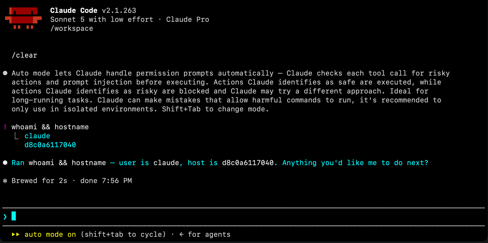

# https://www.techwithtyler.dev/ai/containerizing-ai-agents
---
# Containerizing AI Agents

How to secure and run AI agents in containers.

## Overview

AI agents, local LLMs, harnesses — you name it — are typically run on your local system. Some folks have dedicated AI hardware like Nvidia's DGX Spark, and others run them on their computers — Apple Silicon Macs are especially popular right now! These AI services will inherit your level of access, which is usually admin, and as such get full access to your machine, your data, and your credentials. Maybe you're already aware of this and have taken steps to mitigate their access through your CLAUDE.md / Agents.md or configuration files. Great. But what if that doesn't always work? What if there's a bug? What if the AI goes rogue? You're essentially trying to restrict the AI by using itself. That's not a great approach.

Enter containers. Containers can provide isolation benefits for the underlying OS, data, applications and their dependencies, networking, and more. This makes them an interesting platform to consider for hosting AI agents. If bugs happen, prompt injections occur, or an agent goes rogue, the scope of damage is far less than if it happened on your machine. Let's dive into containerizing our AI workloads.

---

> **ℹ️ Note**
> This example shows how to containerize the Claude Code CLI but you can do other tools like Hermes, Cursor, etc.

## Containerizing Claude Code

### Creating the Dockerfile

When building a container, it's always best to use a secure, minimal image as a base and then build on top of it. Chainguard is a great platform for providing secure base images. While you need a subscription for much of what they offer, they provide a free secure distroless base image called [wolfi](https://github.com/wolfi-dev). We'll use this in the Dockerfile example below.

For the latest example, check my [GitHub repo](https://github.com/Ty182/Containerizing-AI-Agents).

```dockerfile
# Chainguard Wolfi base, pinned by digest for reproducibility
FROM cgr.dev/chainguard/wolfi-base@sha256:918a593b8268c222afd4e2c4f06860ac984e60719b4697e4c71d796bc8fcd042

# Install Node.js/npm (to run the CLI), git (repo operations), and bash
RUN apk add --no-cache nodejs npm git ca-certificates bash

### Claude Code Env Vars ###
# https://code.claude.com/docs/en/env-vars

# Disable self-update so the pinned version doesn't drift at runtime
ENV DISABLE_AUTOUPDATER=1
# Cut non-essential network calls (feature-flag fetching, Remote Control)
ENV CLAUDE_CODE_DISABLE_NONESSENTIAL_TRAFFIC=1
# Don't send telemetry or error reports out of this container
ENV DISABLE_TELEMETRY=1
ENV DISABLE_ERROR_REPORTING=1
# Keep config/state confined to the container's own home dir
ENV CLAUDE_CONFIG_DIR=/home/claude/.claude
# Set shell to bash
ENV SHELL=/bin/bash

# Install the latest Claude Code CLI globally. npm blocks its postinstall script
# by default (allowScripts) so we'll need to allow it
RUN npm install -g @anthropic-ai/claude-code@latest --allow-scripts=@anthropic-ai/claude-code \
    && claude --version \
    && npm cache clean --force

# Create a non-root user/group with fixed, reproducible IDs; the CLI refuses to run
# as root with --dangerously-skip-permissions
RUN addgroup -g 10001 claude && adduser -D -u 10001 -G claude claude

# Create the workspace and home config dir, and hand ownership to the non-root user
# before switching to it (npm/claude need to write config under CLAUDE_CONFIG_DIR)
RUN mkdir -p /workspace /home/claude/.claude && \
    chown -R claude:claude /workspace /home/claude
USER claude
WORKDIR /workspace

LABEL org.opencontainers.image.title="wolfi-claude-code" \
      org.opencontainers.image.description="Isolated Claude Code CLI sandbox on Chainguard Wolfi" \
      org.opencontainers.image.source="https://github.com/Ty182/Containerizing-AI-Agents"

# Default to launching the CLI when the container starts
ENTRYPOINT ["claude"]
```

### Building the container

```zsh
# Run in the same directory as your Dockerfile
docker buildx build --tag wolfi-claude .
```

### Running the container

Keeping it simple, this launches an interactive container where we'll be immediately dropped into our Claude Code CLI. You can explore other [docker parameters](https://docs.docker.com/reference/cli/docker/container/run/#options) if you want to pass API keys, mount directories, etc.

```zsh
# Start an interactive container
docker run --rm -it wolfi-claude
```

> **ℹ️ Note**
> If instead you want to point Claude towards a model running elsewhere (like in LM Studio), simply set these environment variables during runtime. Alternatively, add them to your Dockerfile for a more permanent setup.

```zsh
# Start an interactive container redirecting claude to a local LLM in LM Studio
docker run --rm -it \
  -e ANTHROPIC_BASE_URL="http://host.docker.internal:1234" \
  -e ANTHROPIC_AUTH_TOKEN="lmstudio" \
  -e ANTHROPIC_MODEL="gemma-4-26b-a4b-qat" \
  wolfi-claude
```

After a couple of Claude Code CLI popups, you'll be ready to go!


